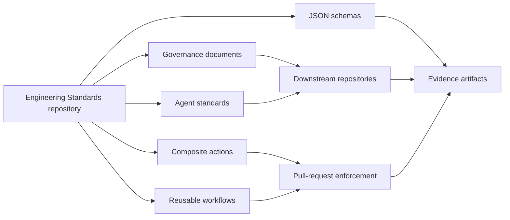

# Engineering Standards

`AIAllTheThingz/Engineering-Standards` is the authoritative engineering-governance repository for reusable organization standards, AI-agent instructions, schemas, templates, composite validation actions, and reusable CI workflows.

The repository prevents governance drift by letting downstream repositories reference immutable central versions instead of copying policy by hand. Local repositories may add stricter controls and operational detail, but they must not weaken mandatory organization controls.

## Governance Philosophy

Governance is safe by default, evidence driven, versioned, and explicit about limits. Work is complete only when required validation has run or has been honestly recorded.

## Authority Hierarchy

1. Applicable law, regulation, contractual requirements, and approved organizational security policy.
2. `governance/ORGANIZATION_CONTRACT.md`.
3. Applicable organization-wide governance documents.
4. `agents/AGENTS_Base.md`.
5. Applicable technology-specific `AGENTS_*.md` files.
6. Repository-root `AGENTS.md`.
7. Directory-local `AGENTS.md`.
8. Task-specific instructions.

Lower-level instructions MAY add detail, stricter validation, local requirements, or technology constraints. They MUST NOT disable mandatory controls, remove completion evidence, bypass testing, authorize prohibited destructive behavior, weaken risk classification, claim validation that did not run, or override organization policy without an approved exception.

## Architecture



## Repository Structure

- `governance/` defines mandatory controls, evidence, risk, exceptions, and AI-generated-code policy.
- `agents/` defines reusable instruction layers; every technology standard inherits `AGENTS_Base.md`.
- `schemas/` defines evidence, artifact, manifest, and governance-configuration contracts.
- `templates/` provides downstream repository, issue, pull-request, test-plan, and threat-model assets.
- `actions/` contains PowerShell 7 composite validation actions.
- `workflows/` contains reusable `workflow_call` CI workflows.
- `scripts/` contains local validation and evidence-generation tooling.
- `examples/` contains minimal downstream consumers.

## Quick Start

```yaml
jobs:
  governance:
    uses: AIAllTheThingz/Engineering-Standards/.github/workflows/governance-ci.yml@<immutable-reference>
    with:
      project-path: .
      governance-version: v1.0.0
```

Use commit SHA pinning for maximum supply-chain integrity. Exact release tags are acceptable with protected releases. Major-version tags are convenient but weaker because they can move.

## Local Validation

```powershell
pwsh -NoProfile -File scripts/Invoke-GovernanceValidation.ps1 -Path .
pwsh -NoProfile -File scripts/Test-JsonSchemas.ps1 -Path .
pwsh -NoProfile -File scripts/Test-MarkdownLinks.ps1 -Path .
pwsh -NoProfile -File actions/forbidden-pattern-scan/Invoke-ForbiddenPatternScan.ps1 -Path .
```

## Maintainer Responsibilities And Limitations

Maintainers own release integrity, review boundaries, schema compatibility, action pinning, downstream migration guidance, exception review, and honest validation reporting. The scanner is heuristic and is not a complete secret scanner, SAST tool, dependency scanner, or compliance engine.
