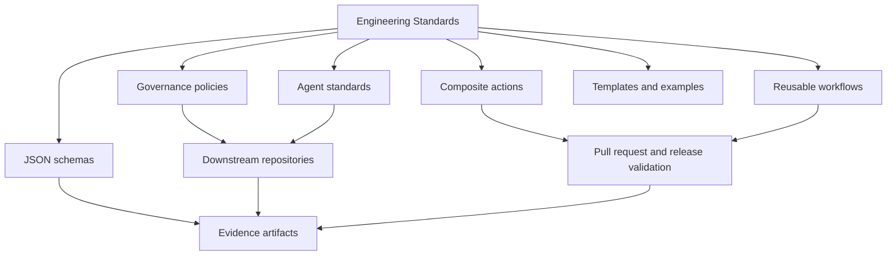

# Engineering Standards

`AIAllTheThingz/Engineering-Standards` is the authoritative source for reusable engineering standards, AI-agent instructions, governance contracts, JSON schemas, repository templates, validation actions, reusable CI workflows, and release evidence.

## Why Centralized Governance Is Needed

Copied governance files drift. A security requirement added to one repository is forgotten in another. AI-agent instructions become inconsistent. Evidence schemas evolve without downstream repositories noticing. This repository centralizes the controls, versions them, and gives downstream repositories a repeatable way to consume them through immutable Git references.

## What This Repository Does

- Defines organization-wide engineering requirements.
- Defines inherited AI-agent standards for common technology domains.
- Provides schemas for project manifests, governance configuration, test evidence, artifact records, and completion results.
- Provides composite actions and reusable workflows for pull-request and release validation.
- Provides templates and examples that downstream repositories can adapt without copying central policy as the synchronization mechanism.
- Records release evidence so maintainers can inspect what was validated and what was not run.

## What This Repository Does Not Do

- It does not replace application-specific architecture decisions.
- It does not store secrets or production configuration.
- It does not guarantee legal or regulatory compliance by itself.
- It does not make the forbidden-pattern scanner a complete secret scanner or SAST tool.

## Governance Philosophy

The repository is safe by default, evidence driven, least-privilege oriented, and explicit about failures. Missing tools are `NotRun`, not `Passed`. Local instructions may strengthen central standards but may not weaken them.

## Authority Hierarchy

1. Applicable law, regulation, contractual requirements, and approved organizational security policy.
2. `governance/ORGANIZATION_CONTRACT.md`.
3. Applicable organization-wide governance documents.
4. `agents/AGENTS_Base.md`.
5. Applicable technology-specific `AGENTS_*.md` files.
6. Repository-root `AGENTS.md`.
7. Directory-local `AGENTS.md`.
8. Task-specific instructions.

Lower-level instructions MAY add implementation detail, stricter validation, project-specific requirements, and technology-specific constraints. Lower-level instructions MUST NOT disable mandatory controls, remove evidence, bypass testing, authorize prohibited destructive behavior, weaken risk classification, claim validation that did not run, or override policy without an approved exception.

## Architecture



## Repository Structure

- `governance/`: organization contract, evidence, risk, exceptions, and AI-generated-code policy.
- `agents/`: base and technology-specific AI-agent standards.
- `schemas/`: strongly typed JSON Schema contracts.
- `actions/`: composite GitHub Actions implemented with PowerShell 7.
- `workflows/`: reusable workflows invoked through `workflow_call`.
- `templates/`: repository, pull-request, issue, test-plan, and threat-model templates.
- `examples/`: functional downstream example projects.
- `scripts/`: local validation and evidence tooling.
- `tests/`: Pester tests and schema fixtures.
- `docs/`: adoption, configuration, architecture, security, release, branch protection, and troubleshooting guidance.
- `evidence/`: final completion evidence and supporting test-result records for the current repository state.

## Major Documents

- [Organization Contract](governance/ORGANIZATION_CONTRACT.md)
- [Completion Evidence](governance/COMPLETION_EVIDENCE.md)
- [Risk Classification](governance/RISK_CLASSIFICATION.md)
- [Exception Process](governance/EXCEPTION_PROCESS.md)
- [AI Generated Code Policy](governance/AI_GENERATED_CODE_POLICY.md)
- [Adoption Guide](docs/ADOPTION_GUIDE.md)
- [Downstream Configuration](docs/DOWNSTREAM_CONFIGURATION.md)
- [Action Security](docs/ACTION_SECURITY.md)
- [Maintainer Guide](docs/MAINTAINER_GUIDE.md)
- [Versioning](docs/VERSIONING.md)
- [Release Process](docs/RELEASE_PROCESS.md)
- [Branch Protection](docs/BRANCH_PROTECTION.md)
- [Troubleshooting](docs/TROUBLESHOOTING.md)
- [Templates](docs/TEMPLATES.md)
- [Changelog](CHANGELOG.md)

## Downstream Adoption Flow

1. Inventory existing local standards and CI checks.
2. Classify the project type and risk.
3. Add `project-manifest.json` and `governance.config.json`.
4. Add a local `AGENTS.md` that references the central base and technology standards.
5. Add a reusable workflow pinned to an immutable reference.
6. Run in advisory mode, remediate failures, then make validation blocking through branch protection.

## Example Workflow

```yaml
name: Governance
on:
  pull_request:
  push:
    branches: [master, main]
permissions:
  contents: read
jobs:
  governance:
    uses: AIAllTheThingz/Engineering-Standards/.github/workflows/governance-ci-reusable.yml@<commit-sha>
    with:
      project-path: .
      governance-version: 1.0.0
```

## Example Local AGENTS.md

```markdown
# AGENTS.md

This repository inherits:
- AIAllTheThingz/Engineering-Standards/agents/AGENTS_Base.md@<commit-sha>
- AIAllTheThingz/Engineering-Standards/agents/AGENTS_PowerShell.md@<commit-sha>

Local rules may add stricter validation and repository-specific commands. Local rules may not weaken central governance.
```

## Example Project Manifest

```json
{
  "schemaVersion": "1.0.0",
  "projectName": "Example Service",
  "repository": "example-org/example-service",
  "description": "Example service used to demonstrate governance adoption.",
  "projectType": "dotnet",
  "technologies": ["dotnet", "github-actions"],
  "governanceVersion": "1.0.0",
  "riskClassification": "Moderate",
  "dataClassification": "Internal",
  "environments": [
    {
      "name": "local",
      "type": "development",
      "production": false
    }
  ],
  "applicableStandards": ["agents/AGENTS_Base.md", "agents/AGENTS_DotNet.md"],
  "requiredWorkflows": ["governance"],
  "externalIntegrations": [],
  "secretsProvider": "example-secrets-provider",
  "productionApprovalRequired": false,
  "owners": ["@example-org/example-owners"],
  "evidence": {
    "completionEvidencePath": "evidence/completion-result.json",
    "testEvidencePath": "evidence/test-evidence.json"
  },
  "exceptions": []
}
```

## Local Validation

```powershell
pwsh -NoProfile -File scripts/Test-JsonSchemas.ps1 -Path .
pwsh -NoProfile -File scripts/Test-MarkdownLinks.ps1 -Path .
pwsh -NoProfile -File scripts/Test-DocumentationCompleteness.ps1 -Path .
pwsh -NoProfile -File scripts/Invoke-GovernanceValidation.ps1 -Path .
Invoke-Pester -Path tests -Output Detailed
```

## Functional Examples

The PowerShell example at `examples/powershell-project` is functional and includes a module manifest, script module, Pester tests, validation script, workflow wiring, and generated test evidence. Run it from the repository root:

```powershell
pwsh -NoProfile -File examples/powershell-project/tools/Test-Example.ps1
```

Other examples are present as adoption targets and should be completed one at a time before they are treated as functional references.

## Release And Versioning

The repository uses semantic versioning. Breaking governance changes require major versions and migration guidance. Downstream CI SHOULD pin commit SHAs for maximum supply-chain integrity. Release notes are maintained in [CHANGELOG.md](CHANGELOG.md), and release procedure is defined in [Release Process](docs/RELEASE_PROCESS.md).

Current version: `1.0.0`.

## Security Reporting And Contributions

Security issues are handled through [SECURITY.md](SECURITY.md). Contributions must follow [CONTRIBUTING.md](CONTRIBUTING.md), include evidence, and avoid false completion claims.

## Release Readiness Notes

- Final evidence is stored in `evidence/completion-result.json`.
- Local YAML parser validation is not configured and is recorded honestly as `NotRun`.
- PSScriptAnalyzer is not installed locally and is recorded honestly as `NotRun`.
- Branch protection must still be verified in GitHub settings because local file validation cannot prove repository settings.
- Functional examples beyond PowerShell remain future work.

## Related Documents

This repository MUST be used with the governing documents in `governance/`, the agent standards in `agents/`, the reusable workflows in `workflows/`, and the validation evidence in `evidence/`. Consumers should start with `docs/ADOPTION_GUIDE.md`, then configure `project-manifest.json` and `governance.config.json` before enabling CI. Exceptions, validation results, and completion evidence are part of the same governance system; they are not optional side files.
