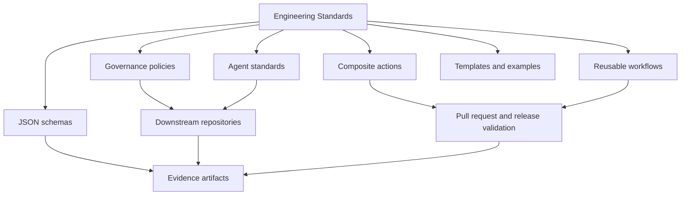

# Engineering Standards

`AIAllTheThingz/Engineering-Standards` is the authoritative source for reusable engineering standards, AI-agent instructions, governance contracts, JSON schemas, repository templates, validation actions, reusable CI workflows, and release evidence.

## Why Centralized Governance Is Needed

Copied governance files drift. A security requirement added to one repository is forgotten in another. AI-agent instructions become inconsistent. Evidence schemas evolve without downstream repositories noticing. This repository centralizes the controls, versions them, and gives downstream repositories a repeatable way to consume them through immutable Git references.

## What This Repository Does

- Defines organization-wide engineering requirements.
- Defines inherited AI-agent standards for common technology domains.
- Provides schemas for project manifests, governance configuration, test evidence, artifact records, completion results, release lifecycle evidence, and downstream compatibility.
- Provides composite actions and reusable workflows for pull-request and release validation.
- Provides templates and examples that downstream repositories can adapt without copying central policy as the synchronization mechanism.
- Records release evidence so maintainers can inspect what was validated and what was not run.

## What This Repository Does Not Do

- It does not replace application-specific architecture decisions.
- It does not store secrets or production configuration.
- It does not guarantee legal or regulatory compliance by itself.
- It does not make the forbidden-pattern scanner a complete secret scanner or SAST tool.

## Governance Philosophy

The repository is safe by default, evidence driven, least-privilege oriented, and explicit about failures. Missing tools are `NotRun`, not `Passed`. Local instructions may strengthen central standards but may not weaken them.

## Authority Hierarchy

1. Applicable law, regulation, contractual requirements, and approved organizational security policy.
2. `governance/ORGANIZATION_CONTRACT.md`.
3. Applicable organization-wide governance documents.
4. `agents/AGENTS_Base.md`.
5. Applicable technology-specific `AGENTS_*.md` files.
6. Repository-root `AGENTS.md`.
7. Directory-local `AGENTS.md`.
8. Task-specific instructions.

Lower-level instructions MAY add implementation detail, stricter validation, project-specific requirements, and technology-specific constraints. Lower-level instructions MUST NOT disable mandatory controls, remove evidence, bypass testing, authorize prohibited destructive behavior, weaken risk classification, claim validation that did not run, or override policy without an approved exception.

## Architecture



## Repository Structure

- `governance/`: organization contract, evidence, risk, exceptions, and AI-generated-code policy.
- `agents/`: base and technology-specific AI-agent standards.
- `.agents/skills/`: governed repository-scoped Codex skills treated as code-adjacent supply-chain inputs.
- `schemas/`: strongly typed JSON Schema contracts.
- `actions/`: composite GitHub Actions implemented with PowerShell 7.
- `.github/workflows/`: executable repository workflows and reusable workflows.
- `workflows/`: distribution templates; GitHub does not execute reusable workflows directly from this root directory.
- `templates/`: repository, pull-request, issue, test-plan, and threat-model templates.
- [`examples/`](examples/README.md): functional downstream projects and isolated home-lab skill demonstrations.
- `scripts/`: local validation and evidence tooling.
- `tests/`: Pester tests and schema fixtures.
- `docs/`: adoption, configuration, architecture, security, release, branch protection, and troubleshooting guidance.
- `evidence/`: final completion evidence and supporting test-result records for the current repository state.

## Major Documents

- [Organization Contract](governance/ORGANIZATION_CONTRACT.md)
- [Completion Evidence](governance/COMPLETION_EVIDENCE.md)
- [Risk Classification](governance/RISK_CLASSIFICATION.md)
- [Exception Process](governance/EXCEPTION_PROCESS.md)
- [AI Generated Code Policy](governance/AI_GENERATED_CODE_POLICY.md)
- [Adoption Guide](docs/ADOPTION_GUIDE.md)
- [Downstream Configuration](docs/DOWNSTREAM_CONFIGURATION.md)
- [Downstream Governance Canary](docs/DOWNSTREAM_CANARY.md)
- [Downstream Compatibility](docs/DOWNSTREAM_COMPATIBILITY.md)
- [Action Security](docs/ACTION_SECURITY.md)
- [Validator Dependency Model](docs/VALIDATOR_DEPENDENCIES.md)
- [Codex Skill Validation](docs/CODEX_SKILL_VALIDATION.md)
- [Backlog Management](docs/BACKLOG_MANAGEMENT.md)
- [Maintainer Guide](docs/MAINTAINER_GUIDE.md)
- [Versioning](docs/VERSIONING.md)
- [Release Process](docs/RELEASE_PROCESS.md)
- [Release Status](docs/RELEASE_STATUS.md)
- [Branch Protection](docs/BRANCH_PROTECTION.md)
- [Troubleshooting](docs/TROUBLESHOOTING.md)
- [Templates](docs/TEMPLATES.md)
- [Changelog](CHANGELOG.md)

## Downstream Adoption Flow

1. Inventory existing local standards and CI checks.
2. Classify the project type and risk.
3. Add `project-manifest.json` and `governance.config.json`.
4. Add a local `AGENTS.md` that references the central base and technology standards.
5. Add a reusable workflow pinned to an immutable reference.
6. Run in advisory mode, remediate failures, then make validation blocking through branch protection.

## Example Workflow

```yaml
name: Governance
on:
  pull_request:
  push:
    branches: [master, main]
permissions:
  contents: read
jobs:
  governance:
    uses: AIAllTheThingz/Engineering-Standards/.github/workflows/governance-ci-reusable.yml@<commit-sha>
    with:
      project-path: .
      governance-version: 1.1.0
      artifact-retention-days: 30
```

The local event workflow is `.github/workflows/governance-ci.yml`. It triggers on pull requests, pushes to `master`, and manual `workflow_dispatch`, then calls both the trusted baseline and the unprivileged candidate-validation harness at the same reviewed full commit SHA. Pinning both self-CI jobs prevents pull-request changes from redefining either security envelope; the baseline treats candidate content as data, while the isolated candidate job deliberately executes proposed validators and tests without secrets or write permissions. Downstream repositories must call the reusable workflow path under `.github/workflows`, not files under the root `workflows/` template directory. The baseline reusable job separates caller content, immutable central tooling, and evidence into `caller/`, `standards/`, and `evidence/`; it never requires downstream copies of central `scripts/`, `actions/`, `tests/`, or `examples/`.

Reusable-workflow releases also require the external proof described in [Downstream Governance Canary](docs/DOWNSTREAM_CANARY.md). Self-CI and the public canary test different trust boundaries; maintainers must run and independently verify all five canary scenarios against the exact candidate SHA before release approval or an authoritative pin rotation.

## Example Local AGENTS.md

```markdown
# AGENTS.md

This repository inherits:
- AIAllTheThingz/Engineering-Standards/agents/AGENTS_Base.md@<commit-sha>
- AIAllTheThingz/Engineering-Standards/agents/AGENTS_PowerShell.md@<commit-sha>

Local rules may add stricter validation and repository-specific commands. Local rules may not weaken central governance.
```

## Example Project Manifest

```json
{
  "schemaVersion": "1.2.0",
  "projectName": "Example Service",
  "repository": "example-org/example-service",
  "description": "Example service used to demonstrate governance adoption.",
  "projectType": "dotnet",
  "technologies": ["dotnet", "github-actions"],
  "governanceVersion": "1.1.0",
  "governanceCommitSha": "<full-40-character-workflow-commit-sha>",
  "workflowInterfaceVersion": "1.0.0",
  "repositoryOwnerType": "Organization",
  "riskClassification": "Moderate",
  "dataClassification": "Internal",
  "environments": [
    {
      "name": "local",
      "type": "development",
      "production": false
    }
  ],
  "applicableStandards": ["agents/AGENTS_Base.md", "agents/AGENTS_DotNet.md"],
  "requiredWorkflows": ["governance"],
  "externalIntegrations": [],
  "secretsProvider": "example-secrets-provider",
  "productionApprovalRequired": false,
  "owners": [{
    "type": "github-team",
    "identifier": "@example-org/example-owners",
    "responsibility": "Approves governance-sensitive changes for this repository.",
    "escalation": "SECURITY.md"
  }],
  "standardsConsumption": {
    "mode": "central-reference",
    "sourceRepository": "AIAllTheThingz/Engineering-Standards",
    "sourceCommitSha": "<full-40-character-workflow-commit-sha>"
  },
  "evidence": {
    "local": {
      "completion": "evidence/local-completion-result.json",
      "tests": "evidence/local-test-results.json"
    },
    "hosted": {
      "workspace": "evidence",
      "completion": "completion-result.json",
      "tests": "ci-test-results.json",
      "artifactNamePattern": "governance-evidence-${run_id}"
    }
  },
  "exceptions": []
}
```

Schema versions `1.0.0` and `1.1.0` remain supported. Version `1.2.0` separates
the semantic governance release from its immutable commit, makes workflow
interface compatibility explicit, and uses structured ownership, standards
consumption, evidence, and exception records. See the [Issue #21 compatibility
proposal](docs/migrations/ISSUE_21_CONTRACT_COMPATIBILITY_PROPOSAL.md).

## Local Validation

The aggregate validator is the authoritative final check. Its default
`standards-maintainer` profile runs every mandatory category in registry order;
an explicit `-Category` list cannot remove mandatory checks. Missing tools and
conditional non-applicability remain visible in the JSON report instead of
being treated as success.

```powershell
pwsh -NoProfile -File scripts/Invoke-GovernanceValidation.ps1 -Path . -RepositoryOwnerType User
```

Use individual validators for focused iteration:

```powershell
pwsh -NoProfile -File scripts/Test-JsonSchemas.ps1 -Path .
pwsh -NoProfile -File scripts/Test-MarkdownLinks.ps1 -Path .
pwsh -NoProfile -File scripts/Test-DocumentationCompleteness.ps1 -Path .
pwsh -NoProfile -File scripts/Test-YamlSyntax.ps1 -Path .
pwsh -NoProfile -File scripts/Test-GitHubWorkflowArchitecture.ps1 -Path .
pwsh -NoProfile -File scripts/Test-CodexSkills.ps1 -Path . -OutputJson .tmp/codex-skills-validation.json
pwsh -NoProfile -File scripts/Test-ValidatorDependencies.ps1 -Path . -OutputJson .tmp/validator-dependencies.json
pwsh -NoProfile -File scripts/Test-ReleaseLifecycle.ps1 -Path . -EvidencePath <release-lifecycle-record.json> -Stage PreRelease
```

See the [Issue #22 coverage matrix](docs/migrations/ISSUE_22_VALIDATION_COVERAGE_MATRIX.md)
for profile, migration, trust-boundary, and status details.

## Functional Examples

The PowerShell example at `examples/powershell-project` is functional and includes a module manifest, script module, Pester tests, validation script, workflow wiring, and generated test evidence. Run it from the repository root:

```powershell
pwsh -NoProfile -File examples/powershell-project/tools/Test-Example.ps1
```

The repository now separates example types explicitly:

- `examples/powershell-project`: functional PowerShell example.
- `examples/dotnet-project`: runtime-dependent .NET example.
- `examples/database-project`: non-mutating migration validation example.
- `examples/web-project`: runtime-dependent web example.
- `examples/worker-service-project`: functional worker-service example.
- `examples/integration-project`: synthetic governed integration flow with signature, replay, duplicate-delivery, partial-success, and redaction checks.
- `examples/infrastructure-project`: synthetic non-mutating plan validation example with generated plan evidence.
- `examples/combined-script-runner-project`: executable synthetic vertical slice demonstrating approved script catalog validation, queue state, idempotency, claim/lease, and atomic report publication.

See the complete [Examples Catalog](examples/README.md) for validation commands
and boundaries for every governed example.

## Home-Lab Skill Demonstrations

Fifteen isolated, portfolio-grade home labs demonstrate skills without
production discovery, secrets, external writes, or an `OPENAI_API_KEY`:

- [`powershell-review`](examples/powershell-review-home-lab/README.md)
- [`python-review`](examples/python-review-home-lab/README.md)
- [`bash-review`](examples/bash-review-home-lab/README.md)
- [`terraform-review`](examples/terraform-review-home-lab/README.md)
- [`build-pester-tests`](examples/build-pester-tests-home-lab/README.md)
- [`safe-automation`](examples/safe-automation-home-lab/README.md)
- [`governance-validation`](examples/governance-validation-home-lab/README.md)
- [`completion-evidence`](examples/completion-evidence-home-lab/README.md)
- [`vendor-documentation-analysis`](examples/vendor-documentation-analysis-home-lab/README.md)
- [`infrastructure-automation-design`](examples/infrastructure-automation-design-home-lab/README.md)
- [`networking`](examples/networking-home-lab/README.md)
- [`operating-systems`](examples/operating-systems-home-lab/README.md)
- [`platforms`](examples/platforms-home-lab/README.md)
- [`virtualization`](examples/virtualization-home-lab/README.md)
- [`frameworks`](examples/frameworks-home-lab/README.md)

Open one home-lab directory as its own workspace to make only that example's
skill discoverable. Deterministic checks validate the package and synthetic
contracts; live model behavior and production certification remain `NotRun`.

## Release And Versioning

The repository uses semantic versioning. Breaking governance changes require major versions and migration guidance. Downstream CI SHOULD pin commit SHAs for maximum supply-chain integrity. Release notes are maintained in [CHANGELOG.md](CHANGELOG.md), and release procedure is defined in [Release Process](docs/RELEASE_PROCESS.md).

Current published version: `1.1.0`. Annotated tag `v1.1.0` resolves to immutable commit `2704049d7e826975d956611b194214dd79ea3686`. Current `master` contains [unreleased changes](CHANGELOG.md#unreleased) beyond that release.

Release candidates use the read-only lifecycle gate in
`scripts/Test-ReleaseLifecycle.ps1`. Its PreRelease, Publication, and
PostRelease stages bind validation, canary runs, human approvals, tag/release
state, and compatibility updates to one immutable SHA. See [Downstream
Compatibility](docs/DOWNSTREAM_COMPATIBILITY.md) for the supported release,
schema, and workflow-interface matrix.

Consumers requiring the final canary-validated repaired reusable workflow should pin `.github/workflows/governance-ci-reusable.yml` to immutable post-release commit `de32b77e2043f5336a54b92ab9ed867abe93ba7e`; the repair is not part of `v1.1.0`. See [Release Status](docs/RELEASE_STATUS.md).

## Security Reporting And Contributions

Security issues are handled through [SECURITY.md](SECURITY.md). Contributions must follow [CONTRIBUTING.md](CONTRIBUTING.md), include evidence, and avoid false completion claims.

## Historical v1.1.0 Evidence Notes

- Local checked-in evidence is stored in `evidence/local-completion-result.json`; GitHub-hosted completion evidence is stored in workflow artifacts.
- `commitSha` and `validatedCommitSha` identify the repository commit that was validated. `evidenceCommitSha` identifies the commit containing a checked-in evidence file when that value is intentionally recorded. GitHub artifact evidence leaves `evidenceCommitSha` null because the artifact is not committed.
- Local evidence remains `Blocked` overall when hosted execution is mandatory, even when a separately verified hosted run is recorded. A local record is not authoritative proof of a GitHub run.
- `evidence/latest-verified-run.json` records metadata for the most recently downloaded and independently verified GitHub success artifact plus the controlled-failure run.
- To trigger the success proof run: `gh workflow run "Governance CI" --ref master -f controlled-failure-test=false`.
- To trigger the controlled failure proof run: `gh workflow run "Governance CI" --ref master -f controlled-failure-test=true`.
- Download workflow evidence with `gh run download <run-id> --name governance-evidence-<run-id> --dir <safe-temp-dir>` and verify it with `scripts/Test-WorkflowEvidenceArtifact.ps1`.
- Forbidden-pattern scanning excludes generated evidence and build output by default. Use `-IncludeGeneratedEvidence` only for diagnostics.
- Detailed Pester audit evidence is stored as sanitized JSON in `evidence/pester-details.json`; raw Pester XML is temporary and is not uploaded.
- Final workflow enforcement occurs after final evidence validation and artifact upload, so controlled failures still produce downloadable evidence.
- The release-target success run is `28304098315` for protected `master` merge commit `2704049d7e826975d956611b194214dd79ea3686`; it does not validate current `master`.
- The paired historical controlled-failure proof run is `28306149811`. That earlier workflow version injected a failed mandatory Markdown outcome after successful Markdown report generation. The repaired workflow instead records a dedicated `ControlledFailure` result after normal validation; both designs upload evidence before final enforcement.
- The independently computed ZIP SHA-256 values are `8cb3dec5db93e1834c38b291ee4445f9c8c69f4954e3152a6c1f296da8d205dd` for success artifact `governance-evidence-28304098315` and `b50936c7c1575af9cce201a9a0e36a46dfc1ce30752482c21d1ca008ae5b0bd2` for controlled-failure artifact `governance-evidence-28306149811`.
- The release target advanced to `2704049d7e826975d956611b194214dd79ea3686` because PR #5 merged executable evidence-validator semantics, shared governance-validation behavior, and regression tests into protected `master`.
- PR #6 metadata cleanup merged at `e17240bb31abf03a3b0d66900fa7a9b9e01225cc`, and post-merge `master` run `28306723435` passed with artifact `governance-evidence-28306723435`; this records release evidence and does not move the immutable release target.
- Historical runs `28281939062`, `28282082709`, `28290761409`, `28293025156`, and `28297679210` remain audit history, but they are no longer the current `v1.1.0` release-validation pair.
- `master` was inspected through the GitHub branch-protection API on 2026-06-28 and currently has verified classic branch protection with required check `Governance / Governance validation`.
- Repository rulesets were inspected on 2026-06-28 and none are configured; classic branch protection is the single active enforcement mechanism.
- Governance approval for `v1.1.0` is complete through PR #10, with formal GitHub approvals from `megad00die` and `mezuccolini`; `GOV-2026-001` is not required.
- PR #12 remediated the PR #11 formal-approval defect. Publication approval remediation is complete.
- Tag and release-publication authorization are granted for `v1.1.0` at immutable target `2704049d7e826975d956611b194214dd79ea3686`.
- The annotated `v1.1.0` tag was created at the authorized target, and the [Engineering Standards v1.1.0 GitHub Release](https://github.com/AIAllTheThingz/Engineering-Standards/releases/tag/v1.1.0) was published as non-draft and non-prerelease on 2026-07-11.
- All 13 Phase 8 local validation records passed. Hosted Governance CI run `29144270291` (#79) and artifact `governance-evidence-29144270291` (ID `8246254113`, SHA-256 `393fad60cc4a130e64fa9816c70d2f86f1cf66c95be75e97956f266a14ec57fb`) were independently verified for PR #27 head `49f9b08271ff55198fee1ed31175ae7e890c3672`, distinct from synthetic merge context `e1ca80c3065e7cb4d81df6cbacb92f332bde9119` at `27/merge`. Post-release verification was recorded, and the six-file metadata follow-up was completed by PR #27, which merged at `2026-07-11T13:30:42Z` as `1f93480003e71bbacfb179f72cde1a1898a9b446` with an identical tree. The local completion record remains `Blocked` solely because local evidence cannot claim overall hosted completion; the annotated tag is unsigned.

## Related Documents

This repository MUST be used with the governing documents in `governance/`, the agent standards in `agents/`, the executable workflows in `.github/workflows/`, the distribution templates in `workflows/`, and the validation evidence in `evidence/`. Consumers should start with `docs/ADOPTION_GUIDE.md`, then configure `project-manifest.json` and `governance.config.json` before enabling CI. Exceptions, validation results, and completion evidence are part of the same governance system; they are not optional side files.
