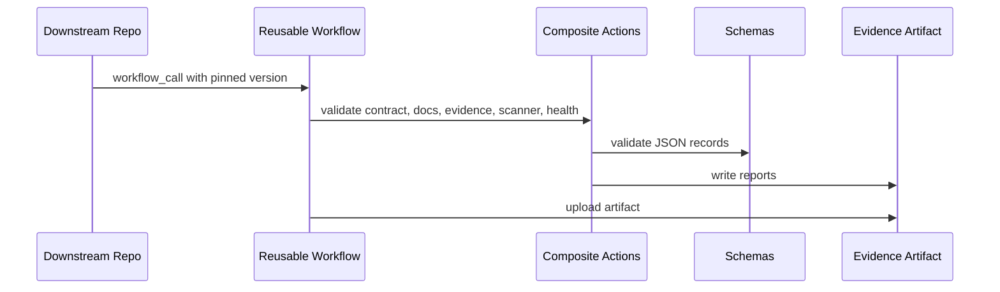

# Governance Architecture

| Status | Active |
| Version | 1.0.0 |
| Owner role | Platform Architecture Maintainers |
| Last reviewed | 2026-06-19 |

## Authority Layers

1. Applicable law, regulation, contractual requirements, and approved organizational security policy.
2. `governance/ORGANIZATION_CONTRACT.md`.
3. Applicable organization-wide governance documents.
4. `agents/AGENTS_Base.md`.
5. Applicable technology-specific `AGENTS_*.md` files.
6. Repository-root `AGENTS.md`.
7. Directory-local `AGENTS.md`.
8. Task-specific instructions.

Lower-level instructions MAY add implementation detail, stricter validation, project-specific requirements, and technology-specific constraints. Lower-level instructions MUST NOT disable mandatory controls, remove evidence, bypass testing, authorize prohibited destructive behavior, weaken risk classification, claim validation that did not run, or override policy without an approved exception.

## Data Flow

## Trust Boundaries

Pull-request content, filenames, configuration, evidence, and generated artifacts are untrusted. Central workflow code is trusted only at the pinned version. Secrets are outside the validation boundary and are not required for pull-request validation.

## Failure Behavior

Mandatory failures return nonzero. Advisory mode records findings without blocking. Missing tools are `NotRun` and must be shown in evidence.

## Governance Operating Requirements

Teams MUST apply this document together with the organization contract, completion evidence policy, exception process, and risk classification model. Validation MUST include the automated checks that apply to the repository type plus a reviewer assessment of any material risk that automation cannot prove. Evidence MUST be stored in the repository or attached to the pull request, and it must distinguish Passed, Failed, Blocked, Skipped, and NotRun results without contradiction.

## Exception Handling

Exceptions MUST follow `governance/EXCEPTION_PROCESS.md`. An exception request needs a `GOV-*` reference, owner, expiry date, compensating control, rollback plan when applicable, and approval from the accountable maintainer. Expired exceptions are treated as failures until renewed or remediated.

## Related Documents

- `governance/ORGANIZATION_CONTRACT.md`
- `governance/COMPLETION_EVIDENCE.md`
- `governance/RISK_CLASSIFICATION.md`
- `governance/EXCEPTION_PROCESS.md`
- `docs/ADOPTION_GUIDE.md`
