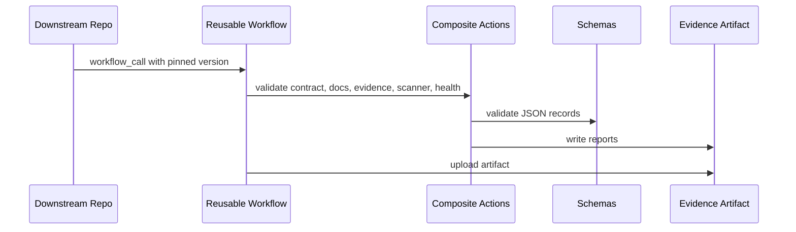

# Governance Architecture

| Status | Active |
| Version | 1.0.0 |
| Owner role | Platform Architecture Maintainers |
| Last reviewed | 2026-06-19 |

## Authority Layers

1. Applicable law, regulation, contractual requirements, and approved organizational security policy.
2. `governance/ORGANIZATION_CONTRACT.md`.
3. Applicable organization-wide governance documents.
4. `agents/AGENTS_Base.md`.
5. Applicable technology-specific `AGENTS_*.md` files.
6. Repository-root `AGENTS.md`.
7. Directory-local `AGENTS.md`.
8. Task-specific instructions.

Lower-level instructions MAY add implementation detail, stricter validation, project-specific requirements, and technology-specific constraints. Lower-level instructions MUST NOT disable mandatory controls, remove evidence, bypass testing, authorize prohibited destructive behavior, weaken risk classification, claim validation that did not run, or override policy without an approved exception.

## Data Flow

## Workflow Architecture

The event-triggered workflow is `.github/workflows/governance-ci.yml`. It runs on pull requests, pushes to `master`, and manual `workflow_dispatch`, and its only job calls `.github/workflows/governance-ci-reusable.yml`.

The reusable workflow is `.github/workflows/governance-ci-reusable.yml`. It is triggered only by `workflow_call`, defines all supported inputs, runs validation jobs, generates completion evidence, and uploads evidence artifacts. It MUST NOT call the event workflow, itself, or any workflow that calls it back.

Root files under `workflows/` are distribution templates. GitHub does not execute reusable workflows directly from that location. Cross-repository callers must use `AIAllTheThingz/Engineering-Standards/.github/workflows/governance-ci-reusable.yml@<full-commit-sha>`.

## Trust Boundaries

Pull-request content, filenames, configuration, evidence, and generated artifacts are untrusted. The caller repository is checked out at `${{ github.sha }}` beneath `caller/`. Central workflow code is checked out separately beneath `standards/` from `${{ job.workflow_repository }}` at the immutable `${{ job.workflow_sha }}`. Validators load only from `standards/`, receive the caller root explicitly, and write generated reports beneath the separate `evidence/` root. Secrets are outside the validation boundary and are not required for pull-request validation.

The caller cannot override the standards repository or SHA. GitHub Enterprise Server does not expose the required `job.workflow_*` identity fields, so the workflow fails closed there rather than selecting a branch, tag, or caller-provided fallback.

## Failure Behavior

Mandatory failures return nonzero. The reusable workflow generates evidence with `if: always()` and uploads validation reports even when a mandatory step fails. Missing tools are `NotRun` and must be shown in evidence; mandatory local workflow validation includes YAML syntax and workflow architecture checks.

The workflow ordering is validation steps, initial test evidence, initial completion evidence, initial evidence validation, final test evidence, final completion evidence, final evidence validation, artifact upload, then final enforcement. Success requires all mandatory steps, final evidence validation, and artifact upload to pass. Controlled failure runs intentionally fail only after failure evidence is generated, evidence validates, and the artifact uploads.

## Reusable Inputs And Outputs

Inputs are `project-path`, `governance-version`, `artifact-retention-days`, and the repository-owned `controlled-failure-test`. Outputs are `evidence-path` and `artifact-name`. The obsolete mandatory-true `run-examples`, `run-pester`, and `run-documentation-validation` inputs were removed. Downstream checks are selected from validated manifest/configuration data; caller-owned code execution remains in caller CI. Artifact uploads identify both caller and standards workflow SHAs and include aggregate validation, dependency, environment, test, and completion evidence.

Engineering Standards maintainer Pester results include structured discovered, passed, failed, skipped, and NotRun counts plus sanitized individual details in the evidence artifact. Zero discovery, failed tests, NotRun tests, or a non-Passed suite result fail validation. Downstream Pester suites are not executed by the central reusable workflow; callers record those results through their own CI and evidence process.

Generated evidence, build output, package directories, coverage, and test result folders are excluded from ordinary forbidden-pattern scans. `-IncludeGeneratedEvidence` exists for explicit diagnostic scans.

Completion evidence uses `validatedCommitSha` for the validated repository content and `evidenceCommitSha` for checked-in evidence files when supplied. GitHub artifact evidence leaves `evidenceCommitSha` null and is tied to `githubRunId` plus `githubRunAttempt`.

## Governance Operating Requirements

Teams MUST apply this document together with the organization contract, completion evidence policy, exception process, and risk classification model. Validation MUST include the automated checks that apply to the repository type plus a reviewer assessment of any material risk that automation cannot prove. Evidence MUST be stored in the repository or attached to the pull request, and it must distinguish `Passed`, `Failed`, `Blocked`, `NotRun`, and `NotApplicable` results without contradiction. Raw framework-level skip counts remain details within a test record and are not completion statuses.

## Exception Handling

Exceptions MUST follow `governance/EXCEPTION_PROCESS.md`. An exception request needs a `GOV-*` reference, owner, expiry date, compensating control, rollback plan when applicable, and approval from the accountable maintainer. Expired exceptions are treated as failures until renewed or remediated.

## Related Documents

- `governance/ORGANIZATION_CONTRACT.md`
- `governance/COMPLETION_EVIDENCE.md`
- `governance/RISK_CLASSIFICATION.md`
- `governance/EXCEPTION_PROCESS.md`
- `docs/ADOPTION_GUIDE.md`
- `scripts/Test-GitHubWorkflowArchitecture.ps1`
